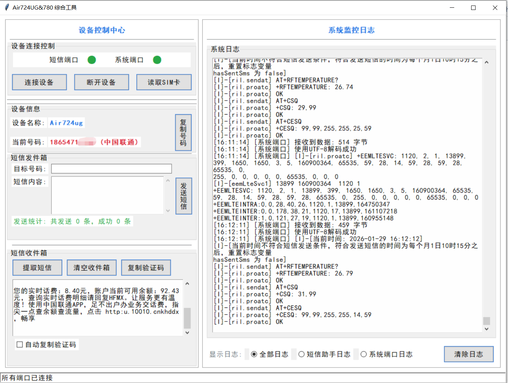

# Air724UG 综合工具

## 项目简介

Air724UG 综合工具是一款专为Air724UG模块设计的多功能应用程序，整合了短信助手和串口监控工具的核心功能，提供了直观的图形界面，方便用户进行设备管理、短信收发和串口监控等操作。

本工具适用于需要使用Air724UG模块进行短信通信、设备监控的场景，如物联网设备管理、远程监控系统、验证码接收等。


## 功能特点

- **双端口管理**：同时连接短信助手端口和监控工具端口，实现并行操作
- **智能设备识别**：自动检测并选择合适的串口端口，简化连接流程
- **设备状态显示**：实时显示设备连接状态，当两个端口都连接成功时，自动将读取到的手机号码作为设备名称
- **整合日志系统**：支持多维度日志查看（全部日志、仅短信助手日志、仅监控工具日志），方便问题排查
- **短信发送功能**：支持向指定手机号码发送短信，并提供发送统计信息
- **SIM卡信息读取**：快速读取并显示SIM卡的手机号码和运营商信息
- **自动复制验证码**：智能提取短信中的验证码并自动复制到剪贴板，提升使用效率
- **智能乱码修复**：自动检测并修复短信内容中的乱码问题，确保信息可读性
- **功能状态提醒**：实时反馈功能开启/关闭状态，如自动复制验证码功能的启用提醒
- **短信收件箱**：自动收集并显示接收到的短信，支持手动刷新收件箱

## 系统要求

- **操作系统**：Windows 7/8/10/11
- **Python版本**：Python 3.6 或更高版本
- **硬件需求**：Air724UG模块及配套USB数据线
- **驱动程序**：需安装Air724UG模块对应的USB驱动

## 安装说明

### 方法一：使用虚拟环境（推荐）

1. **克隆或下载项目**到本地目录
2. **创建虚拟环境**：
   ```powershell
   python -m venv .venv
   ```
3. **激活虚拟环境**：
   - Windows PowerShell：
     ```powershell
     .venv\Scripts\Activate.ps1
     ```
   - Windows CMD：
     ```cmd
     .venv\Scripts\activate.bat
     ```
4. **安装依赖包**：
   ```powershell
   pip install -r requirements.txt
   ```
5. **启动程序**：
   ```powershell
   python combined_gui.py
   ```

### 方法二：直接运行批处理文件

1. **确保已安装Python 3.6或更高版本**
2. **双击运行** `run_combined_tool.bat` 文件启动程序

## 使用方法

### 1. 设备连接

1. 将Air724UG模块通过USB数据线连接到电脑
2. 启动程序后，系统会**自动检测**可用的串口端口
3. 点击**"连接"**按钮连接短信助手端口
4. 点击**"打开串口"**按钮连接监控工具端口
5. 当两个端口都连接成功时，设备名称会显示为读取到的手机号码

### 2. 日志管理

1. 在日志类型下拉菜单中选择需要查看的日志类型：
   - **全部日志**：显示所有操作和通信日志
   - **仅短信助手日志**：仅显示与短信相关的操作日志
   - **仅监控工具日志**：仅显示串口监控相关的日志
2. 点击**"清除日志"**按钮可以清空当前显示的日志内容

### 3. 短信发送

1. 在"目标手机号"输入框中填写接收短信的手机号码
2. 在"短信内容"文本框中输入要发送的短信内容
3. 点击**"发送短信"**按钮发送短信
4. 发送完成后，程序会显示发送统计信息

### 4. SIM卡信息

1. 确保设备已成功连接
2. 点击**"读取SIM卡信息"**按钮
3. 系统会自动读取并显示SIM卡的手机号码和运营商信息

### 5. 自动复制验证码

1. 勾选**"自动复制验证码"**复选框开启该功能
2. 当收到包含验证码的短信时，系统会自动提取验证码并复制到剪贴板
3. 日志框会显示"已启用自动复制验证码功能"的提醒信息

### 6. 短信收件箱管理

1. 系统会**自动收集**并显示接收到的短信
2. 点击**"刷新收件箱"**按钮可以重新读取所有短信
3. 系统会自动处理短信内容中的乱码问题，确保显示清晰可读的短信内容

## 注意事项

1. **驱动安装**：使用前请确保已安装Air724UG模块的正确驱动程序，否则可能无法识别设备
2. **硬件连接**：确保Air724UG模块正确连接到电脑，USB数据线接触良好
3. **SIM卡状态**：发送短信前请确保SIM卡已激活并有足够的余额
4. **短信中心**：短信中心号码可能需要根据地区进行修改，确保短信能够正常发送
5. **验证码识别**：自动复制验证码功能支持常见的验证码格式，对于特殊格式的验证码可能无法正确识别
6. **乱码修复**：智能乱码修复功能会尽可能还原短信内容，但对于严重损坏的短信可能无法完全修复
7. **日志管理**：为了获得更好的使用体验，建议定期清理日志文件，避免日志过多影响程序性能
8. **权限设置**：在某些Windows系统中，可能需要以管理员身份运行程序才能正常访问串口

## 项目文件说明

| 文件名 | 作用描述 |
|--------|--------|
| **README.md** | 项目说明文档，包含功能介绍、安装指南和使用方法等详细信息 |
| **combined_air724ug_tool.code-workspace** | Visual Studio Code工作区配置文件，用于保存项目的编辑器设置和调试配置 |
| **combined_gui.py** | 主程序文件，实现了所有核心功能，包括双端口管理、短信发送、设备状态显示等 |
| **combined_gui.spec** | PyInstaller打包配置文件，用于将Python代码打包成独立的可执行文件(.exe) |
| **requirements.txt** | 项目依赖文件，列出了运行程序所需的Python包及其版本，如pyserial（用于串口通信） |
| **run_combined_tool.bat** | Windows批处理文件，提供便捷的程序启动方式，双击即可运行 |
| **.venv/** | Python虚拟环境文件夹，包含独立的Python解释器和安装的依赖包，确保环境一致性 |

## 常见问题

### Q: 无法找到串口设备怎么办？
A: 请检查以下几点：
   - Air724UG模块是否正确连接到电脑
   - 是否安装了正确的USB驱动程序
   - 设备管理器中是否能看到串口设备
   - 尝试更换USB数据线或USB端口

### Q: 发送短信失败怎么办？
A: 请检查以下几点：
   - SIM卡是否已激活并有足够余额
   - 短信中心号码是否设置正确
   - 网络信号是否良好
   - 目标手机号码格式是否正确

### Q: 无法读取SIM卡信息怎么办？
A: 请检查以下几点：
   - 设备是否已成功连接
   - SIM卡是否正确插入模块
   - SIM卡是否支持读取卡号信息

## 版本历史

- **v1.0.0**：初始版本，实现基本功能
- **v1.0.1**：优化自动复制验证码功能，提高识别准确率
- **v1.0.2**：增强乱码修复能力，改进用户界面

## 贡献与反馈

如果您在使用过程中遇到问题或有改进建议，欢迎提出反馈。您可以通过以下方式参与项目：

- 提交Issue报告问题
- 提交Pull Request贡献代码
- 分享使用经验和建议

---

**免责声明**：本工具仅供学习和研究使用，请遵守相关法律法规，合理使用短信功能，避免发送垃圾短信或进行其他违法活动。